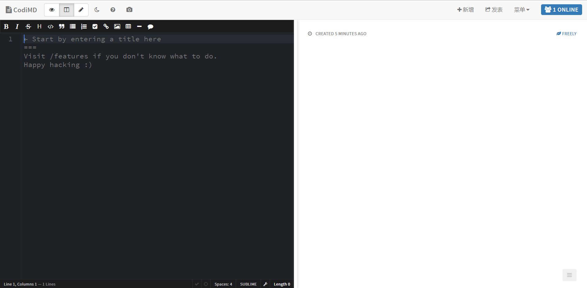
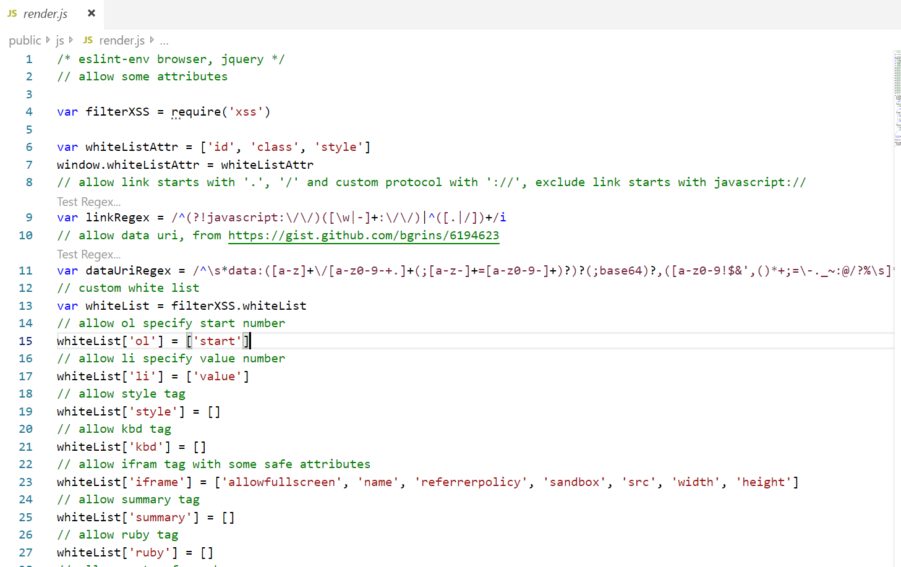
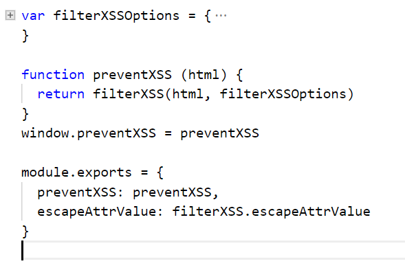
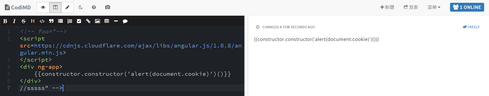

# 软件系统安全 —— CodiMD XSS漏洞分析及复现

## 零.XSS漏洞背景

### 0.什么是XSS漏洞

**定义：**跨站脚本攻击

跨站脚本攻击是指恶意攻击者往Web页面里插入恶意Script代码，当用户浏览该页之时，嵌入其中Web里面的Script代码会被执行，从而达到恶意攻击用户的目的。

XSS漏洞通常是通过PHP的输出函数将Javascript代码输出到html页面中，通过用户本地浏览器执行的，所以XSS漏洞关键就是寻找参数未过滤的输出函数。

**在本实验中也是通过寻找在JS函数中的未过滤参数函数，使得进行XSS攻击。**

### 1.XSS漏洞分类

从攻击代码的工作方式可以分为三个类型：

1. **持久型跨站**：跨站代码存储在服务器（数据库）代码是存储在服务器中的，如在个人信息或发表文章等地方，加入代码，如果没有过滤或过滤不严，那么这些代码将储存到服务器中，每当有用户访问该页面的时候都会触发代码执行，这种XSS容易造成大量盗窃cookie的风险。**简单来说就是恶意代码已经写入数据库中。**

2. **非持久型跨站**：反射型跨站脚本漏洞，用户访问服务器-跨站链接-返回跨站代码。攻击者事先制作好攻击链接, 需要欺骗用户自己去点击链接才能触发XSS代码（服务器中没有这样的页面和内容），一般容易出现在搜索页面。**简单来说就是并没有写入数据库中，执行仅一次有效。**

3. **DOM跨站**（DOM XSS）：DOM（document object model文档对象模型），客户端脚本处理逻辑导致的安全问题。基于文档对象模型Document Objeet Model，DOM)的一种漏洞。DOM是一个与平台、编程语言无关的接口，它允许程序或脚本动态地访问和更新文档内容、结构和样式，处理后的结果能够成为显示页面的一部分。客户端的脚本程序可以通过DOM动态地检查和修改页面内容，它不依赖于提交数据到服务器端，而从客户端获得DOM中的数据在本地执行，如果DOM中的数据没有经过严格确认，就会产生DOM XSS漏洞。**简单来说就是对于元素显示进行攻击的操作。本次实验的XSS攻击属于此类。使用网站本身没有过滤注释的漏洞来污染DOM。**

### 2.漏洞原理

**XSS的漏洞的最主要成因是后端接收参数时未经过滤，导致参数改变了HTML的结构。**

#### A.反射型XSS/非持久型

首先要寻找带参数的输出函数，接下来通过输出内容回溯到输入参数，观察是否过滤即可。

比如直接在input框中输入代码：<script>alert('xss')</script>进行alert调用。

#### B.存储型XSS/持久型

和反射性XSS的即时响应相比，存储型XSS则需要先把利用代码保存在比如数据库或文件中，当web程序读取利用代码时再输出在页面上执行利用代码。但存储型XSS不用考虑绕过浏览器的过滤问题，屏蔽性也要好很多。

比如对于一个有写入日志功能的PHP来说，如果之前写入了恶意代码，在打开日志文件的时候就有可能触发恶意函数的调用。一次提交之后，每当有用户访问这个页面都会受到XSS攻击，危害巨大。

#### C.DOM XSS

当动态页面中插入的内容含有这些特殊字符（如<）时，用户浏览器会将其误认为是插入了HTML标签，当这些HTML标签引入了一段JavaScript脚本时，这些脚本程序就将会在用户浏览器中执行。所以，当这些特殊字符不能被动态页面检查或检查出现失误时，就将会产生DOM XSS漏洞。

### 3.XSS漏洞特征

1. 由于XSS攻击在用户当前使用的应用程序中执行，用户将会看到与其有关的个性化信息，如账户信息或“欢迎回来”消息，克隆的Web站点不会显示个性化信息。

2. 通常，在钓鱼攻击中使用的克隆Web站点一经发现，就会立即被关闭。

3. 许多浏览器与安全防护软件产品都内置钓鱼攻击过滤器，可阻止用户访问恶意的克隆站点。

4. 如果客户访问一个克隆的Web网银站点，银行一般不承担责任。但是，如果攻击者通过银行应用程序中的XSS漏洞攻击了银行客户，则银行将不能简单地推卸责任。

### 4.常用攻击方式

常用的XSS攻击手段和目的有：

1. 盗用cookie，获取敏感信息。

2. 利用植入Flash，通过crossdomain权限设置进一步获取更高权限；或者利用Java等得到类似的操作。

3. 利用iframe、frame、XMLHttpRequest或上述Flash等方式，以（被攻击）用户的身份执行一些管理动作，或执行一些一般的如发微博、加好友、发私信等操作。

4. 利用可被攻击的域受到其他域信任的特点，以受信任来源的身份请求一些平时不允许的操作，如进行不当的投票活动。

5. 在访问量极大的一些页面上的XSS可以攻击一些小型网站，实现DDoS攻击的效果。

**XSS漏洞相关函数：`eval()` ，`assert()` ，`preg_replace()` 回调函数 动态执行函数**

### 5.XSS漏洞防范

#### A.反射型/非持久型XSS漏洞防范

对标签内容进行转义，增加标签使得标签内函数无法执行

```markdown
a.PHP直接输出html的，可以采用以下的方法进行过滤：
    1.htmlspecialchars函数
    2.htmlentities函数
    3.HTMLPurifier.auto.php插件
    4.RemoveXss函数
b.PHP输出到JS代码中，或者开发Json API的，则需要前端在JS中进行过滤：
    1.尽量使用innerText(IE)和textContent(Firefox),也就是jQuery的text()来输出文本内 容
    2.必须要用innerHTML等等函数，则需要做类似php的htmlspecialchars的过滤
c.其它的通用的补充性防御手段
    1.在输出html时，加上Content Security Policy的Http Header
    （作用：可以防止页面被XSS攻击时，嵌入第三方的脚本文件等）
    （缺陷：IE或低版本的浏览器可能不支持）
    2.在设置Cookie时，加上HttpOnly参数
    （作用：可以防止页面被XSS攻击时，Cookie信息被盗取，可兼容至IE6）
    （缺陷：网站本身的JS代码也无法操作Cookie，而且作用有限，只能保证Cookie的安全）
    3.在开发API时，检验请求的Referer参数
    （作用：可以在一定程度上防止CSRF攻击）
    （缺陷：IE或低版本的浏览器中，Referer参数可以被伪造）
```

#### B.存储型XSS漏洞防范

基本方法同上所述，也是使用相应的函数来进行转义过滤操作

#### C.DOM XSS漏洞防范

因为DOM XSS漏洞相对于之前的漏洞来说更加隐蔽，因此在对DOM元素进行操作的时候，注意是否在前端会执行恶意代码，需要前端开发者的检查和分析。

##  一.CodiMD XSS漏洞分析/复现

### 0.背景介绍

1. CodiMD：在线使用Markdown写作分享的软件
2. 网址：[https://pad.degrowth.net](https://pad.degrowth.net/)

在线编辑MD文档：




### 1.实验环境

**CodiMD** : version 1.3.2 Latest release

​                  version 1.2.1 

​			 	Source code (zip)

DownLoad Address: CTOLib码库

https://cpp.ctolib.com/article/releases/110922

**VSCode**：version 1.36.0

### 2.实验原理

#### A.EJS工作方式

EJS是一个JavaScript模板库，用来从JSON数据中生成HTML字符串。

#### B.Codi版本历史

CodiMD：server-1.2.1 ——此版本有漏洞

CodiMD：server-1.3.2 ——此版本漏洞已修复

#### C.源码阅读

public/js目录下存在render.js文件，打开后如下图所示：



这部分js使用了npm/xss模块进行过滤非法字符串：（对于node.js XSS库的使用参考Github项目文档https://github.com/leizongmin/js-xss/blob/master/README.zh.md）

```javascript
var filterXSS = require('xss')
```

同时对于部分使用的属性使用了白名单机制，只容许以下的三个属性出现：

```javascript
var whiteListAttr = ['id', 'class', 'style']
```

并且对链接及数据部分使用了正则表达式替换了字符，防止形如`javascript://`的链接造成简单的XSS注入，对于数据段部分也规定了合法的字符：

```javascript
var linkRegex = /^(?!javascript:\/\/)([\w|-]+:\/\/)|^([.|/])+/i
var dataUriRegex = /^\s*data:([a-z]+\/[a-z0-9-+.]+(;[a-z-]+=[a-z0-9-]+)?)?(;base64)?,([a-z0-9!$&',()*+;=\-._~:@/?%\s]*)\s*$/i
```

对于引入的模块XSS使用里面内置的whitelist白名单，并且自定义白名单内容，使之不会遭到XSS攻击：

````javascript
var whiteList = filterXSS.whiteList
````

在这部分代码中只容许白名单中出现的属性，比如style中值为空，则对style中的所有属性过滤，将不能对样式进行修改。

核心代码：



在1.2.1版本中，查看核心代码函数filterXSSOptions后发现问题：

```javascript
 onIgnoreTag: function (tag, html, options) {
    // allow comment tag
    if (tag === '!--') {
            // do not filter its attributes
      return html
    }
  },
```

在这一部分中使用了onIgnoreTag来对某型tag进行忽略/不过滤，在这里因为CodiMD本身功能的原因容许使用注释，例如<!-- -->来对文档进行注释，而对于html又不加过滤直接返回，因此我们可以在注释中构造XSS攻击。

例如可以构造类似的HTML内容来插入恶意代码，其中通过”——>“来闭合前面的注释标签：

```javascript
<!-- foo="bar--> <s>XSS Attack</s>" -->
```

但是在server-1.3.2版本中，修复了这个漏洞，如下所示：

```javascript
onIgnoreTag: function (tag, html, options) {
    // allow comment tag
    if (tag === '!--') {
            // do not filter its attributes
      return html.replace(/<(?!!--)/g, '&lt;').replace(/-->/g, '__HTML_COMMENT_END__').replace(/>/g, '&gt;').replace(/__HTML_COMMENT_END__/g, '-->')
    }
  },
```

对于html文档在返回前进行了replace字符串过滤，对标签进行了转义。无法通过在注释中插入script代码来达到执行效果。

### 3.实验步骤

在线编辑md文档，试图插入<script>js代码：


观察到没有结果输出，因为对于<>标签被转义（加上了&lt和&gt等过滤操作）。



### 4.实验结果

如图所示，代码没有执行，而是直接在右侧显示栏中渲染出来。

### 5.Codi漏洞补丁

目前最新版本的CodiMD已经修复了此漏洞。

### 6.漏洞分析

对于DOM XSS漏洞来说必须要前端开发者对于函数的规范使用，才能尽可能避免XSS漏洞。在函数的返回值或者是输出函数等地方一定需要检查是不是有可以注入XSS的地方，不给攻击者可乘之机。

## 二.参考文献：

腾讯云：如何判断网站存在XSS漏洞：https://cloud.tencent.com/developer/article/1352463

CodiMD 源码下载地址：https://cpp.ctolib.com/article/releases/110922

CSDN XSS漏洞总结：https://blog.csdn.net/qq_31481187/article/details/53027208

A Wormable XSS on HackMD!：https://blog.orange.tw/2019/03/a-wormable-xss-on-hackmd.html

npm/XSS官方中文文档：https://github.com/leizongmin/js-xss/blob/master/README.zh.md